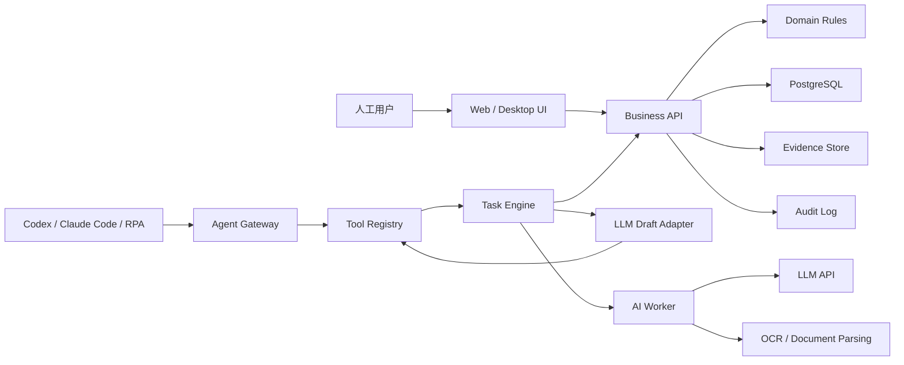

# Agent 原生财务系统设计

## 1. 设计目标

本系统要支持 Agent 像虚拟员工一样完成财务工作，而不是只在界面上模拟人工点击。Codex、Claude Code、内部 RPA 或未来自研 Agent 应通过稳定的任务接口读取数据、生成计划、执行 dry-run、提交审批、落地执行并留下审计记录。

目标不是让 Agent 无限制接管财务系统，而是让它在权限、证据、审批和审计约束下替代重复人工工作。

## 2. 设计原则

1. Agent 不直接绕过业务规则。
2. 所有写操作先 dry-run，再执行。
3. 高风险动作必须审批。
4. 所有建议必须绑定证据。
5. 所有执行必须可回放、可解释、可追踪。
6. UI 给人用，Tool API 给 Agent 用，二者共享同一套业务规则。

## 3. 总体架构



## 4. 核心组件

### 4.1 Agent Gateway

Agent Gateway 是所有 Agent 的统一入口。它负责认证、权限、任务创建、工具暴露、dry-run、审批状态、幂等控制和审计。

必须支持：

- Agent 身份注册。
- 用户授权和代理操作范围。
- 按角色返回可用工具。
- 每个写操作要求 `idempotencyKey`，幂等记录必须绑定账套 scope，并按 TTL 过期；默认重放窗口为 7 天，过期 key 在新写请求前清理，未过期 key 跨账套复用必须拒绝。
- 每个高风险操作进入审批流。
- 记录 Agent 的输入、计划、工具调用、执行结果和证据。

### 4.2 Tool Registry

Tool Registry 把财务系统能力转成 Agent 可调用工具。工具要稳定、语义清晰、参数结构化，避免让 Agent 依赖页面 DOM。

第一批工具：

| 工具 | 风险 | 说明 |
| --- | --- | --- |
| `search_vouchers` | 低 | 查询凭证 |
| `search_business_documents` | 低 | 查询采购、销售、库存、薪资、固资单据 |
| `create_voucher_draft` | 中 | 创建凭证草稿 |
| `suggest_voucher_from_evidence` | 中 | 根据票据、流水、合同生成凭证建议 |
| `suggest_master_data_draft` | 中 | 根据合同、Excel 或用户描述生成基础档案候选草稿 |
| `suggest_purchase_order_draft` | 中 | 生成采购申请、采购订单、采购发票或付款申请草稿 |
| `suggest_sales_order_draft` | 中 | 生成销售报价、销售订单、销售发票或收款计划草稿 |
| `suggest_inventory_movement_draft` | 中 | 生成入库、出库、调拨、库存调整草稿 |
| `suggest_material_requisition_draft` | 中 | 根据工单、BOM、仓库指令生成生产领料候选草稿 |
| `suggest_product_receipt_draft` | 中 | 根据工单、完工报告、检验单生成完工入库候选草稿 |
| `suggest_stock_count_draft` | 中 | 生成盘点任务、盘盈盘亏调整草稿 |
| `suggest_payroll_allocation_draft` | 中 | 生成工资分摊和人工成本池草稿 |
| `run_depreciation_dry_run` | 中 | 生成固定资产折旧 dry-run 候选草稿（`draftType=depreciation_run`），人工确认后只落独立草稿，不锁定正式折旧 |
| `suggest_asset_change_draft` | 中 | 生成资产新增、转移、原值变动或处置草稿 |
| `run_close_checklist` | 中 | 执行月末结账检查 |
| `suggest_ar_reconciliation` | 中 | 生成应收核销建议 |
| `suggest_ap_reconciliation` | 中 | 生成应付核销建议 |
| `generate_report_run` | 中 | 生成报表运行结果 |
| `suggest_report_interpretation_draft` | 低 | 根据报表单元格和来源链路生成解读草稿 |
| `submit_for_approval` | 中 | 将草稿或任务提交审批 |
| `post_approved_voucher` | 高 | 对已审批凭证正式记账 |
| `execute_approved_payment` | 高 | 对已审批付款执行付款流程 |
| `close_approved_period` | 高 | 对已审批期间执行结账 |

### 4.3 Task Engine

Task Engine 负责把自然语言或业务目标拆成可执行步骤。它不直接改数据，只编排工具调用。

示例任务：“整理 5 月采购付款凭证”。

执行步骤：

1. 查询 5 月采购入库单。
2. 查询 5 月采购发票。
3. 查询供应商付款单。
4. 匹配供应商、金额、税额、期间。
5. 生成应付凭证草稿。
6. 生成付款凭证草稿。
7. 检查借贷平衡和辅助核算。
8. 标记异常项。
9. 提交人工审批。

### 4.3.1 草稿填写任务

草稿填写任务是 Task Engine 的高频场景。Agent 可以把自然语言、上传附件的本地 OCR 结果、历史单据和当前页面上下文转换为候选草稿，但它不直接保存正式业务数据。

示例任务：“根据这张供应商报价单生成采购订单草稿”。

执行步骤：

1. 读取当前账套、期间、用户权限和页面上下文。
2. 对用户上传的报价单、合同、发票、仓库指令、盘点表等附件先运行本地 OCR / 文档解析，生成可预览的 `ocrResults`。
3. 用户可以修正 OCR 文本，系统保存原始文本、修正文本、修正人和修正时间。
4. 把人工确认后的 OCR 文本、附件 Hash、用户指令和页面上下文交给 `LLM Draft Adapter`，提取供应商、物料、数量、单价、税率和交期。
5. 调用主数据检索，匹配供应商、存货、计量单位、税率和仓库。
6. 对未匹配或多候选字段生成 `unmatchedItems`。
7. 调用 `LLM Draft Adapter` 生成符合采购订单 Schema 的候选草稿。
8. 调用业务规则 dry-run，检查必填项、期间状态、价格、库存/仓库约束和审批要求。
9. 返回候选草稿、OCR 证据、置信度、警告和需人工选择的字段。
10. 用户确认后，系统调用业务 API 保存为正式“草稿”状态。

所有草稿填写任务都必须保留模型输入摘要、OCR 结果、模型输出、系统匹配结果、人工修改差异和最终草稿 ID。折旧测算类任务必须把模型输出限制为 `depreciation_run` dry-run 候选草稿，转换后保存到独立的 Agent 折旧测算草稿，不得写入正式折旧运行、折旧成本池或锁定资产折旧。

### 4.4 Evidence Store

Evidence Store 保存 Agent 做判断所依据的证据。

证据类型：

- 发票
- 银行流水
- 合同
- 采购订单
- 入库单
- 销售订单
- 出库单
- 仓库指令
- 盘点表
- BOM 和工单
- 工资表
- 固定资产卡片
- 审批记录
- 用户补充说明
- OCR 结果和人工修正文本

没有证据的 Agent 建议只能进入草稿或异常队列，不能自动执行正式财务动作。

### 4.4.1 LLM Draft Adapter

LLM Draft Adapter 是大模型 API 的统一封装层。它负责把业务上下文转成模型输入，把模型输出约束到目标草稿 Schema，并把结果交回 Tool Registry 和业务规则 dry-run。

必须支持：

- 云端模型和本地模型的供应商配置。
- 模型调用超时、重试、token 上限和审计日志。
- 输入脱敏策略，如银行账号、身份证号、手机号、工资明细等敏感字段脱敏。
- 接收本地 OCR / 文档解析后的结构化文本，不直接绕过附件服务读取原始文件。
- 按 `draftType` 选择 prompt 模板和 JSON Schema。
- 结构化输出失败时返回可解释错误，不自动降级为自由文本落库。
- 模型生成的主数据引用必须由系统二次匹配确认。

运行时适配边界：

- OCR 层通过 `ocrAdapter.extractText` 接入本地模型，默认 provider 为 `local-ocr-placeholder`。生产部署可使用 `local-command-ocr` + `AIS_OCR_COMMAND` / `AIS_OCR_COMMAND_ARGS` 调用本地 OCR 命令，或使用 `local-tesseract` 调用本机 Tesseract，也可注入 `configured-local-ocr`（例如 PaddleOCR `ppocr-v4`）。
- 大模型层通过 `llmDraftAdapter.generateDraft` 注入，默认 provider 为 `local-rule-based`，生产部署可配置为 `openai-compatible` 或私有模型网关。
- `LLM Draft Adapter` 收到的 `evidenceRefs` 必须合并用户提供的证据和附件 ID，保证模型输出可以回溯到上传凭证和 OCR 结果。
- `sourceContext.sourceObject` 必须覆盖采购订单、销售订单、库存移动、盘点预览、生产工单、凭证、工资计算单、固定资产卡片、折旧测算页面和报表运行；凭证快照至少包含 `voucherNo`、`voucherDate`、`fiscalYear`、`periodNo`、附件引用以及 `lines[].summary/accountCode/accountName/debit/credit`，工资和固资快照至少包含计算单成本汇总、员工/部门明细、资产编号、净值、原值、累计折旧和当前部门，折旧测算页面至少包含 `fiscalYear`、`periodNo` 和 `runNo` 候选，报表快照至少包含 `reportRunId`、`snapshotHash`、单元格 `evidenceRef` 和追溯链。

LLM Draft Adapter 的输出格式：

```json
{
  "draftType": "purchase_order",
  "sourceContext": {},
  "matchedMasterData": [],
  "unmatchedItems": [],
  "draftPayload": {},
  "confidence": 0.82,
  "warnings": [],
  "evidenceRefs": []
}
```

### 4.5 Approval Workflow

审批流按风险分级。

| 风险 | 可自动执行 | 需要审批 |
| --- | --- | --- |
| 低 | 查询、分析、解释、生成报表草稿 | 不需要 |
| 中 | 创建草稿、生成核销建议、运行检查 | 重要场景需要 |
| 高 | 记账、付款、结账、反结账、作废、删除 | 必须 |

高风险审批至少记录：

- 发起人
- Agent 身份
- 审批人
- 风险等级
- 证据
- dry-run 结果
- 影响范围
- 执行结果

### 4.6 Replay 与 Audit

每个 Agent 动作都必须可回放。

必须记录：

- Agent 收到的任务
- Agent 读取的数据范围
- Agent 生成的计划
- 调用的工具
- 每次工具调用参数
- dry-run 结果
- 审批记录
- 最终执行结果
- 影响的单据、凭证、账簿和报表

Agent Action 详情和 Replay API 必须同时返回 `auditSummary`，用于汇总审批进度、证据校验状态、Replay 事件序列、下一步动作和 `mutationState`，避免审批人只能阅读原始 JSON 载荷。

## 5. Agent Action 数据模型

```text
AgentAction
  id
  accountSetId
  fiscalPeriodId
  requestedByUserId
  agentId
  title
  objective
  riskLevel
  status
  idempotencyKey
  plan
  dryRunResult
  approvalRequest
  executionResult
  evidenceRefs
  auditRefs
  createdAt
  submittedAt
  approvedAt
  executedAt
  archivedAt
```

状态机：

```text
created
-> planning
-> dry_run_completed
-> submitted_for_approval
-> approved
-> executed
-> archived

created
-> planning
-> dry_run_completed
-> rejected
-> archived

executed
-> reversed
-> archived
```

## 6. API 设计方向

Agent API 不应该直接暴露底层 CRUD，而应暴露任务和工具。

建议新增接口：

```text
GET  /agent/tools
POST /agent/actions
GET  /agent/actions/{id}
POST /agent/actions/{id}/dry-run
POST /agent/actions/{id}/submit
POST /agent/actions/{id}/approve
POST /agent/actions/{id}/execute
POST /agent/actions/{id}/reverse
GET  /agent/actions/{id}/replay
```

工具调用接口：

```text
POST /agent/tools/{toolName}/invoke
```

每次调用都必须包含：

```json
{
  "accountSetId": "string",
  "fiscalPeriodId": "string",
  "idempotencyKey": "string",
  "dryRun": true,
  "input": {},
  "evidenceRefs": []
}
```

草稿生成接口：

```text
POST /agent/draft-candidates
GET  /agent/draft-candidates/{id}
POST /agent/draft-candidates/{id}/dry-run
POST /agent/draft-candidates/{id}/convert
POST /ai/llm-draft-runs
```

草稿生成请求必须包含：

```json
{
  "accountSetId": "string",
  "fiscalPeriodId": "string",
  "draftType": "purchase_order",
  "sourceObjectType": "purchase_quote",
  "sourceObjectId": "string",
  "userInstruction": "string",
  "evidenceRefs": [],
  "dryRun": true
}
```

## 7. UI 的 Agent-friendly 要求

虽然 Agent 应优先使用 Tool API，但 UI 也要支持浏览器 Agent。

要求：

- 每个页面有稳定 URL。
- 每个主要按钮有稳定 `data-testid`。
- 表格支持搜索、筛选、排序、分页。
- 表单字段有明确 label。
- 错误提示结构化。
- 页面状态清晰展示。
- 所有批量动作有预览和确认页。
- 提供命令面板，支持搜索功能和跳转任务。
- 支持从采购订单、销售订单、仓库单据、盘点、生产工单、凭证、工资分摊、折旧测算、资产变动和报表单元格等上下文打开草稿生成 Agent。
- 草稿生成界面必须展示字段级来源、匹配置信度、未匹配项、dry-run 错误和人工修改痕迹。

## 8. 开发路线

### Phase A: Agent 基础设施

- Agent Gateway
- Tool Registry
- AgentAction 数据模型
- dry-run 机制
- 审计日志

### Phase B: 低风险工具

- 查询凭证
- 查询账簿
- 查询业务单据
- 运行报表
- 解释报表

### Phase C: 中风险工具

- OCR 结构化
- 生成凭证草稿
- 生成采购、销售、仓库、盘点、生产、薪资、固资和报表解读草稿
- 生成核销建议
- 生成结账检查报告
- 生成异常清单

### Phase D: 高风险审批执行

- 审批后记账
- 审批后付款
- 审批后结账
- 审批后反向处理

### Phase E: 无人值守任务

- 每日票据整理
- 每日银行流水匹配
- 每周应收催收清单
- 月末结账检查
- 管理报表自动生成

## 9. 验收标准

- Agent 能完成查询、草稿、检查、提交审批、审批后执行的完整闭环。
- Agent 能在订单、仓库、盘点、生产、凭证、薪资、固资和报表页面生成候选草稿，并在人工确认后保存为系统草稿。
- Agent 无法绕过权限直接执行高风险动作。
- 每个 Agent 动作都能回放。
- 每个正式财务动作都能追溯到证据。
- 人工 UI 与 Agent API 使用同一套领域规则。
- dry-run 与正式执行结果的差异必须可解释。
- 已执行动作可通过反向流程处理，而不是静默删除。
