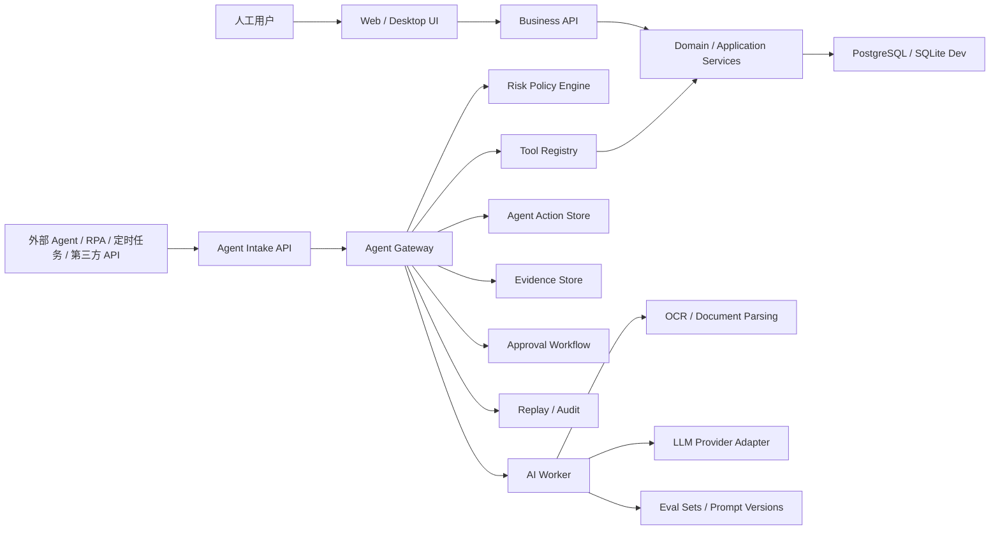
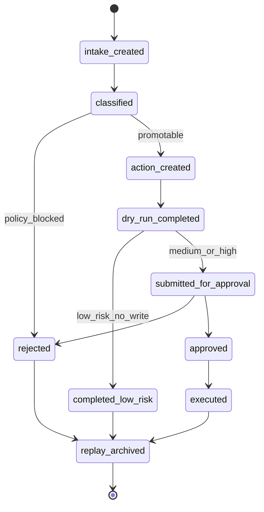

# AIS ERP Suite AgentOS 升级开发治理文档

文档日期：2026-06-28
适用仓库：`jahad4387-ops/ais-erp-suite`
本地路径：`D:\codex工作区\ais-erp-suite`
当前基线：`62ce90b docs: add full development audit report`
文档定位：生产化升级、Agent 原生升级、业务逻辑保护、工程治理与多轮 Codex 开发协议
参考模板：`EGSS AgentOS Skill v2.2 JSON Protocol Control + Beginner Friendly Interaction Edition`

---

## 0. 白话结论

这个项目不应该被“重做”，也不应该为了看起来简单而删除业务逻辑。它已经有一套覆盖总账、采购、销售、库存、生产、薪资、固定资产、报表和 Agent 设计的业务骨架。下一步正确路线是：

1. 保留现有公司业务逻辑和财务内控逻辑。
2. 把现有业务规则固化成可测试、可追溯、可审计的不变量。
3. 先补生产级底座，再让 Agent 进入低风险、重复性、高耗时工作。
4. Agent 只能自动做查询、整理、匹配、草稿、检查、解释、提醒等低风险事项。
5. 付款、过账、关账、删除、反结账、核心主数据变更，必须由人审批并承担责任。

一句话目标：

> 把 `ais-erp-suite` 从“高覆盖 AIS/ERP MVP”升级为“业务规则稳定、内控可审计、Agent 可安全接入、可生产化试点的 AI 原生 ERP/AIS 系统”。

---

## 1. Source of Truth

后续开发遇到冲突时，按以下优先级裁决：

| 优先级 | 来源 | 用途 |
| ---: | --- | --- |
| 1 | 已合并到 GitHub 的代码、测试、OpenAPI、Prisma schema | 当前真实系统状态 |
| 2 | 本文档 | 后续升级路线、Agent 边界、Work Packet 拆分和治理协议 |
| 3 | `docs/project-development-audit-2026-06-27.md` | 当前实现审计、验证证据、缺口清单 |
| 4 | `docs/agent-native-design.md` | Agent Gateway、Tool Registry、Approval、Replay 的已有设计 |
| 5 | `docs/architecture.md`、`docs/implementation-roadmap.md` | 原始架构和 Phase 0-6 路线 |
| 6 | 用户在后续会话中的 Change Request | 对本文档的受控变更 |

本文档被采纳后，新增开发不得跳过 Contract First、Work Packet、Validation Gate，也不得让 Codex 单次会话直接开发完整业务模块。

---

## 2. Requirement Ledger

### 2.1 已确认目标

| 编号 | 需求 | 决策 |
| --- | --- | --- |
| R-001 | 保留现有业务逻辑 | 必须保留总账、P2P、O2C、库存、生产成本、薪资、固定资产、报表、审计、审批、附件、证据链 |
| R-002 | 优化不是推倒重来 | 采用“保护业务规则 + 工程硬化 + Agent 受控接入”的渐进式升级 |
| R-003 | Agent 可替人做低风险重复事项 | 支持 OCR、导入校验、匹配建议、凭证草稿、催收草稿、月结检查、报表解释、异常清单 |
| R-004 | 预留可输入 API 的处理端口 | 新增 Agent Intake API 作为外部 Agent、RPA、定时任务、文件导入和第三方系统的统一入口 |
| R-005 | 高风险动作必须人工审批 | Agent 不能单独执行过账、付款、关账、删除、反结账、正式主数据变更 |
| R-006 | 生产化前必须修复关键工程风险 | API 拆分、金额精度、CI、pnpm workspace、Agent 持久化、PostgreSQL、备份恢复 |
| R-007 | 文档要可交给 Codex 多会话执行 | 必须包含阶段、契约、允许路径、禁止路径、测试命令、验收门禁 |

### 2.2 明确不做

| 编号 | 不做事项 | 原因 |
| --- | --- | --- |
| N-001 | 不删除现实业务所需流程 | ERP/AIS 的复杂度来自真实公司流程，不能用简化损害可用性 |
| N-002 | 不让 Agent 直接写核心业务表 | 会破坏责任链、审计链和数据可信度 |
| N-003 | 不把页面 DOM 自动化作为主 Agent 接口 | Agent 应优先调用稳定 Tool API，浏览器自动化只作辅助 |
| N-004 | 不在 `services/api/src/api.mjs` 上继续堆 Phase 6 | 该文件已接近一万行，继续堆会放大维护风险 |
| N-005 | 不先做炫技 AI 聊天框 | 先做可审计、可回放、可控风险的工作流 Agent |

### 2.3 默认假设

| 假设 | 说明 |
| --- | --- |
| 部署形态 | 先支持内网/私有云试点，再保留 SaaS 化空间 |
| 技术路线 | 当前保持模块化单体 + 独立 AI worker，不提前拆成微服务 |
| Agent 入口 | 默认和业务 API 同域部署；生产可拆成独立 Agent Gateway |
| 数据库方向 | 开发期保留 SQLite 能力，生产化目标为 PostgreSQL |
| 金额类型 | 财务金额最终迁移到 Decimal 或最小货币单位整数 |
| 开发方式 | 每个 Codex 会话只处理 Feature Slice 或 Component Part |

---

## 3. 当前基线判断

### 3.1 已有优势

| 领域 | 当前优势 |
| --- | --- |
| 业务覆盖 | Phase 1-5 已覆盖总账、采购、销售、库存、生产、薪资、固定资产、报表 |
| 测试基础 | 当前审计中 `npm test` 通过 290 个测试 |
| 契约意识 | OpenAPI 已覆盖大量业务路径，并已有 AgentAction 契约雏形 |
| Agent 方向 | 已明确 dry-run、审批、证据、审计、Replay，不是简单聊天框 |
| 报表设计 | 报表快照、锁定、公式、drilldown 和 AI 解读比普通 MVP 更完整 |
| 内控意识 | 凭证、审批、附件、审计日志、幂等键等设计已经出现 |

### 3.2 当前缺口

| 优先级 | 缺口 | 影响 |
| --- | --- | --- |
| P0 | 财务金额大量使用 `Float` | 汇总、税额、工资、折旧、成本和报表有精度风险 |
| P0 | Phase 6 Agent runtime 未完整实现 | Agent 设计不能生产化落地 |
| P0 | API 主文件过大 | 新增 Agent/生产化功能会导致维护风险快速上升 |
| P0 | 权限、审批、审计、风险等级还未形成底层统一控制面 | 高风险业务难以证明可控 |
| P1 | CI 只跑部分测试 | GitHub 合并门禁不足 |
| P1 | 根目录缺少 `pnpm-workspace.yaml` | pnpm workspace 安装行为不可靠 |
| P1 | AI worker 仍偏说明文档 | OCR/LLM/评估集/模型适配器未服务化 |
| P1 | SQLite 与 PostgreSQL 目标不一致 | 生产部署、事务、并发和备份恢复需要补齐 |
| P2 | Web bundle 偏大 | 前端加载和长期扩展会受影响 |

---

## 4. 升级总原则

### 4.1 业务逻辑保护原则

以下规则视为系统不变量，优化时只能强化，不能削弱：

1. 正式财务数据不得物理删除。
2. 已过账凭证只能通过冲销、调整或受控反向流程处理。
3. 已关账期间默认禁止新增、修改、删除影响财务结果的数据。
4. 凭证必须保留来源单据、来源行、附件、证据引用和审计日志。
5. 应收、应付、库存、薪资、固定资产必须能与总账对账。
6. 报表锁定后必须基于快照渲染，不能被后续未授权数据改写。
7. 工资、折旧、生产成本池在锁定前不能被正式成本分配消费。
8. Agent 建议不能混入正式业务结果，必须先作为草稿、建议或异常项保存。
9. 高风险动作必须有人类审批人，Agent 不能同时当发起人和审批人。
10. 所有写操作必须支持幂等键、责任主体、风险等级和审计追踪。

### 4.2 工程治理原则

| 原则 | 解释 |
| --- | --- |
| Contract First | 改接口、改数据、改权限前先改契约和测试 |
| Feature Slice First | Codex 单次任务只处理可测试的小闭环 |
| Module Before Global | 先模块内集成，再全局集成 |
| No Business Module Direct Implementation | 不允许把“整个库存模块”“整个 Agent 模块”直接派给一个会话 |
| Evidence Before Execution | 没证据的 Agent 输出只能是说明或异常，不能执行正式业务动作 |
| Dry-run Before Commit | 所有 Agent 写动作先 dry-run，再审批，再执行 |
| Human Accountability | 高风险动作由人承担最终责任，系统记录责任链 |
| Reversible By Process | 已执行动作通过业务反向流程纠正，不能静默删除 |

---

## 5. 目标架构

### 5.1 总体架构



### 5.2 模块边界

| 模块 | 责任 | 升级方向 |
| --- | --- | --- |
| `platform` | 账套、组织、用户、角色、权限、期间、审计 | 增加统一风险策略、字段权限、Agent 身份 |
| `general-ledger` | 科目、凭证、账簿、辅助核算、试算平衡 | 金额 Decimal 化、凭证动作责任链 |
| `procure-to-pay` | 采购、入库、发票、应付、付款、核销 | Agent 做三单匹配、付款建议、异常清单 |
| `order-to-cash` | 销售、出库、发票、应收、收款、核销 | Agent 做回款匹配、账龄提醒、催收草稿 |
| `inventory-costing` | 库存、BOM、工单、成本层、盘点、成本分配 | 增强 BOM 版本、MRP、WIP、批次、QC |
| `payroll` | 薪资项目、工资计算、分摊、成本池 | Agent 做导入校验和异常解释，不自动发薪 |
| `fixed-assets` | 资产卡片、折旧、处置、盘点、对账 | Agent 做折旧预检和盘点差异说明 |
| `reporting` | 报表模板、公式、快照、导出、AI 解读 | Agent 做报表解释、差异归因、管理摘要 |
| `agent-control-plane` | Intake、Action、Tool、Approval、Replay、Evidence | 新增底层持久化和运行时闭环 |
| `ai-worker` | OCR、LLM、提示词、评估、供应商适配 | 从 README 升级为可运行服务 |

---

## 6. Agent Intake API 输入端口设计

### 6.1 设计目标

Agent Intake API 是给外部 Agent、RPA、定时任务、文件导入、邮件收件箱和第三方系统使用的统一输入端口。它不直接执行 ERP 写操作，只负责接收任务、标准化输入、绑定证据、判断风险、生成 AgentAction 或低风险结果。

### 6.2 推荐服务端口

| 环境 | 默认策略 | 说明 |
| --- | --- | --- |
| 开发环境 | 复用业务 API 端口 | 降低本地复杂度 |
| 内网试点 | `AGENT_GATEWAY_PORT=4301` | 只允许内网/VPN 访问 |
| AI worker | `AI_WORKER_PORT=4302` | 仅允许 API/Gateway 调用，不直接暴露公网 |
| SaaS/公网 | 通过 HTTPS API Gateway 统一入口 | 需要 WAF、限流、签名和租户隔离 |

生产默认不开放裸端口，必须经过 HTTPS、鉴权、租户隔离、请求签名和审计。

### 6.3 预留 API 路径

| 方法 | 路径 | 风险 | 用途 |
| --- | --- | --- | --- |
| `POST` | `/agent-intake/jobs` | low | 接收外部输入任务，创建标准化 intake job |
| `GET` | `/agent-intake/jobs/{jobId}` | low | 查询输入任务状态 |
| `POST` | `/agent-intake/jobs/{jobId}/classify` | low | 执行风险分级、证据检查和工具推荐 |
| `POST` | `/agent-intake/jobs/{jobId}/promote-action` | medium | 将合格任务提升为 AgentAction |
| `POST` | `/agent/tools/{toolName}/invoke` | low/medium | 调用受控工具，默认 dry-run |
| `POST` | `/agent/actions` | medium/high | 创建 AgentAction，兼容现有 OpenAPI 方向 |
| `POST` | `/agent/actions/{id}/dry-run` | medium/high | 执行动作预演 |
| `POST` | `/agent/actions/{id}/submit` | medium/high | 提交审批 |
| `POST` | `/agent/actions/{id}/approve` | high | 人工审批 |
| `POST` | `/agent/actions/{id}/execute` | high | 人工审批后执行 |
| `GET` | `/agent/actions/{id}/replay` | low | 回放完整动作链 |
| `POST` | `/agent/webhooks/{sourceName}` | low | 接收受信外部系统回调 |

### 6.4 Agent Intake 请求契约

```json
{
  "accountSetId": "as_001",
  "fiscalPeriodId": "fp_2026_06",
  "requestedByUserId": "user_finance_001",
  "source": {
    "type": "external_api",
    "name": "bank_statement_connector",
    "correlationId": "bank_20260628_001"
  },
  "objective": "整理 2026 年 6 月银行流水，生成低风险匹配建议和异常清单",
  "inputKind": "bank_statement",
  "allowedRiskLevels": ["low", "medium"],
  "dryRunOnly": true,
  "idempotencyKey": "as_001:bank_statement:2026-06:001",
  "payload": {
    "currency": "CNY",
    "statementDate": "2026-06-28",
    "rows": [
      {
        "transactionDate": "2026-06-28",
        "description": "客户回款",
        "amount": "12800.00",
        "counterparty": "示例客户"
      }
    ]
  },
  "evidenceRefs": [],
  "constraints": {
    "noPosting": true,
    "noPayment": true,
    "noPeriodClose": true,
    "noPhysicalDelete": true
  },
  "callback": {
    "url": "https://example.internal/erp-agent-callback",
    "events": ["job.completed", "job.failed", "approval.required"]
  }
}
```

### 6.5 Agent Intake 响应契约

```json
{
  "jobId": "aij_20260628_0001",
  "status": "accepted",
  "riskLevel": "low",
  "nextAction": "classification_pending",
  "acceptedTools": [
    "parse_bank_statement",
    "match_bank_transactions",
    "generate_reconciliation_suggestions"
  ],
  "blockedActions": [
    "post_voucher",
    "execute_payment",
    "close_period",
    "delete_financial_record"
  ],
  "auditRef": "audit_20260628_0001",
  "traceId": "trace_20260628_0001"
}
```

### 6.6 认证与限流

| 控制点 | 要求 |
| --- | --- |
| API Key | 存在 `AgentApiCredential`，只保存 hash，不保存明文 |
| 请求签名 | 外部系统必须提交 HMAC 或等价签名 |
| 幂等键 | 所有写入 intake/action 的请求必须有 `idempotencyKey` |
| 租户隔离 | `accountSetId` 必须参与权限校验 |
| 速率限制 | 按 agent、账套、来源系统、IP 四个维度限流 |
| 回调安全 | callback URL 必须在白名单或租户配置中 |
| 密钥管理 | 不提交 `.env`、API key、供应商 token 到 GitHub |

---

## 7. Agent 风险分级与可替人事项

### 7.1 风险等级

| 风险 | Agent 可否自动执行 | 典型事项 | 控制 |
| --- | --- | --- | --- |
| Low | 可以自动完成 | 查询、整理、OCR、分类、匹配候选、报表解释、异常清单、提醒草稿 | 记录日志和证据 |
| Medium | 可以生成草稿或建议 | 凭证草稿、核销建议、月结检查、批量导入修复建议、库存预警 | 进入人工确认或审批队列 |
| High | 不可由 Agent 单独执行 | 过账、付款、关账、反结账、删除、正式主数据变更、大额调整 | 必须人工审批和执行 |

### 7.2 第一批低风险可自动化工具

| 工具名 | 输入 | 输出 | 业务价值 |
| --- | --- | --- | --- |
| `ocr_invoice_to_evidence` | 发票图片/PDF | 结构化证据、置信度、异常字段 | 替代人工录票第一步 |
| `parse_bank_statement` | 银行流水文件/API 数据 | 标准化流水行 | 替代表格清洗 |
| `match_bank_transactions` | 流水、应收应付、客户供应商 | 匹配候选和置信度 | 减少核销筛选时间 |
| `generate_reconciliation_suggestions` | AP/AR/银行流水 | 核销建议、差异说明 | 提高对账效率 |
| `suggest_voucher_from_evidence` | 发票、合同、入库单、付款单 | 凭证草稿 | 减少重复凭证录入 |
| `run_close_checklist` | 期间、账套 | 月结检查清单 | 减少漏检 |
| `detect_inventory_risk` | 库存、周转、成本层 | 呆滞、负库存、异常成本 | 提前暴露库存风险 |
| `generate_ar_collection_drafts` | 账龄、客户、历史回款 | 催收草稿 | 替代重复催收文字 |
| `explain_report_variance` | 报表快照、drilldown 数据 | 差异解释草稿 | 辅助管理分析 |
| `prepare_audit_evidence_pack` | 凭证、单据、附件、审批 | 审计证据包索引 | 提高审计取证效率 |

### 7.3 禁止 Agent 自动执行的事项

| 禁止事项 | 规则 |
| --- | --- |
| 自动付款 | Agent 只能生成付款建议或付款申请草稿 |
| 自动过账 | Agent 只能生成凭证草稿或 dry-run 结果 |
| 自动关账 | Agent 只能运行关账检查清单 |
| 自动删除 | 正式数据不允许物理删除 |
| 自动反结账 | 必须人工审批、记录原因、生成审计链 |
| 自动修改核心主数据 | 客户、供应商、科目、税率、工资规则、BOM 生效版本等必须人工确认 |
| 自动覆盖报表快照 | 已锁定报表只能通过受控重开或新版本处理 |

---

## 8. Agent 控制面数据模型

以下模型用于补齐 Phase 6 runtime，不要求一次性全部实现，但新增 Agent 功能必须沿这个方向收敛。

### 8.1 核心模型

| 模型 | 关键字段 | 说明 |
| --- | --- | --- |
| `AgentActor` | `id`, `name`, `type`, `status`, `createdByUserId` | Agent 身份，不等同于人类用户 |
| `AgentApiCredential` | `id`, `agentId`, `keyHash`, `scope`, `expiresAt`, `lastUsedAt` | 外部 API 认证凭据 |
| `AgentIntakeJob` | `id`, `accountSetId`, `requestedByUserId`, `sourceType`, `objective`, `status`, `riskLevel` | 外部输入任务 |
| `AgentTool` | `id`, `name`, `riskLevel`, `inputSchema`, `outputSchema`, `enabled` | 可调用工具注册表 |
| `AgentAction` | `id`, `toolName`, `riskLevel`, `status`, `idempotencyKey`, `plan`, `dryRunResult` | Agent 动作主表 |
| `AgentEvidence` | `id`, `evidenceType`, `storageRef`, `hash`, `sourceDocumentId`, `metadata` | 证据链 |
| `AgentApproval` | `id`, `agentActionId`, `approvedByUserId`, `decision`, `comment`, `decidedAt` | 审批记录 |
| `AgentReplayEvent` | `id`, `agentActionId`, `sequenceNo`, `eventType`, `payloadHash`, `createdAt` | 回放事件 |
| `AgentRiskPolicy` | `id`, `scope`, `rule`, `effect`, `priority`, `enabled` | 风险策略 |
| `AgentEvalCase` | `id`, `toolName`, `inputFixture`, `expectedChecks`, `lastScore` | AI 工具评估集 |

### 8.2 AgentAction 责任链字段

`AgentAction` 必须保留以下责任字段：

```text
requestedByUserId
agentId
operatedOnBehalfOfUserId
approvedByUserId
executedByUserId
riskLevel
permissionScope
evidenceRefs
auditRefs
idempotencyKey
dryRunHash
executionHash
replayTraceId
```

### 8.3 状态机



---

## 9. Contract First 契约包

### 9.1 API Contract

必须维护：

1. `services/api/openapi.yaml`
2. Agent Intake API 请求/响应 schema
3. AgentAction lifecycle endpoints
4. Tool Registry invoke schema
5. 审批、执行、回放接口
6. 错误码、风险等级、权限字段

所有 Agent 写接口必须包含：

```json
{
  "accountSetId": "string",
  "fiscalPeriodId": "string",
  "requestedByUserId": "string",
  "idempotencyKey": "string",
  "dryRun": true,
  "evidenceRefs": ["string"],
  "payload": {}
}
```

### 9.2 Data Contract

金额字段对外传输建议统一为字符串：

```json
{
  "amount": "12800.00",
  "currency": "CNY",
  "scale": 2
}
```

内部迁移策略：

1. 财务金额、税额、成本、工资、折旧、报表值优先迁移到 Decimal。
2. 数量、税率、折旧率、完工率等非金额数值可单独评估。
3. API 返回保持兼容期，前端显示统一通过金额格式化工具。

### 9.3 Event Contract

Agent runtime 至少记录这些事件：

| 事件 | 说明 |
| --- | --- |
| `agent.intake.accepted` | 输入任务被接收 |
| `agent.intake.classified` | 风险分级完成 |
| `agent.action.created` | 动作创建 |
| `agent.action.dry_run_completed` | 预演完成 |
| `agent.action.approval_requested` | 提交审批 |
| `agent.action.approved` | 审批通过 |
| `agent.action.rejected` | 审批拒绝 |
| `agent.action.executed` | 执行完成 |
| `agent.action.policy_blocked` | 被策略阻断 |
| `agent.replay.archived` | 回放链归档 |

### 9.4 Permission Contract

权限命名建议：

```text
agent_intake.create
agent_intake.read
agent_tool.invoke_low
agent_tool.invoke_medium
agent_action.create
agent_action.submit
agent_action.approve
agent_action.execute
agent_action.replay
agent_policy.manage
agent_credential.manage
```

高风险权限不得授予 AgentActor，只能授予人类用户或服务账户，并且执行时必须记录代表谁执行。

---

## 10. JSON Protocol Control Layer

### 10.1 Upgrade Controller

```json
{
  "ais_erp_agentos_upgrade_controller": {
    "mode": "strict_engineering_governance",
    "source_of_truth": [
      "github_repository",
      "adopted_upgrade_document",
      "project_audit_report",
      "openapi_contract",
      "prisma_schema",
      "tests"
    ],
    "default_codex_unit": "feature_slice",
    "blocked_actions": [
      "implement_entire_business_module_in_one_session",
      "allow_agent_direct_core_db_write",
      "skip_dry_run_for_write_action",
      "skip_human_approval_for_high_risk_action",
      "change_financial_behavior_without_tests",
      "commit_secrets_or_env_files"
    ],
    "required_gates": [
      "contract_gate",
      "business_invariant_gate",
      "permission_gate",
      "agent_risk_gate",
      "validation_gate",
      "handoff_gate"
    ]
  }
}
```

### 10.2 Agent Risk Policy JSON

```json
{
  "agent_risk_policy": {
    "low": {
      "allowed": [
        "query",
        "classify",
        "ocr",
        "parse",
        "match_candidates",
        "generate_explanation",
        "generate_reminder_draft",
        "prepare_report_draft"
      ],
      "requires_approval": false,
      "allowed_writes": ["AgentIntakeJob", "AgentAction", "AgentEvidence", "AgentReplayEvent"]
    },
    "medium": {
      "allowed": [
        "create_voucher_draft",
        "create_reconciliation_suggestion",
        "create_close_checklist",
        "create_import_fix_suggestion"
      ],
      "requires_approval": "conditional",
      "formal_business_write": false
    },
    "high": {
      "allowed": [
        "post_approved_voucher",
        "execute_approved_payment",
        "close_approved_period",
        "reverse_approved_transaction"
      ],
      "requires_approval": true,
      "agent_can_approve": false,
      "agent_can_execute_without_human": false
    }
  }
}
```

### 10.3 Work Packet Schema

```json
{
  "work_packet": {
    "task_id": "string",
    "packet_type": "feature_slice_work_packet",
    "target_domain": "string",
    "target_module": "string",
    "objective": "string",
    "allowed_paths": ["string"],
    "forbidden_paths": ["string"],
    "source_documents": ["string"],
    "input_contracts": ["string"],
    "output_contracts": ["string"],
    "business_invariants": ["string"],
    "implementation_steps": ["string"],
    "test_commands": ["string"],
    "acceptance_criteria": ["string"],
    "rollback_plan": "string",
    "handoff_required": true
  }
}
```

---

## 11. 分阶段升级路线

### Phase U0：升级基线冻结

目标：把升级方向、业务不变量、Agent 边界和工程门禁冻结成正式文档。

交付：

- 本文档。
- README 文档入口。
- 后续 Change Request 规则。

验收：

- 文档明确保留业务逻辑。
- 文档明确 Agent 低/中/高风险边界。
- 文档明确 API 输入端口。
- 文档明确 Work Packet 与 Validation Gate。

### Phase U1：工程硬化

目标：先让仓库更适合长期开发，避免继续在单文件中堆复杂功能。

建议任务：

1. 增加根级 `pnpm-workspace.yaml`，或正式决定统一 npm。
2. 扩展 CI：domain、API、database、web lint、web build、Prisma validate、安全审计。
3. 拆分 `services/api/src/api.mjs` 的路由注册、权限中间件、错误处理、审计工具。
4. 建立 application service 层，把业务规则从 API 大文件逐步抽出。
5. 为拆分前后行为建立 characterization tests。

验收：

- 新 CI 能覆盖当前主要验证命令。
- API 拆分不改变现有业务结果。
- `npm test` 继续通过。
- OpenAPI 与 runtime 行为不倒退。

### Phase U2：金额精度与财务可信度

目标：消除财务系统使用 `Float` 的生产级风险。

建议任务：

1. 盘点 `schema.prisma` 中所有金额、税额、成本、工资、折旧、报表值字段。
2. 定义 Money/Decimal 领域对象。
3. 优先迁移总账、往来、库存成本、薪资、折旧、报表。
4. API 金额字段统一字符串传输。
5. 补对账、舍入、税额、工资、折旧、报表快照测试。

验收：

- 关键财务金额不再依赖二进制浮点。
- 旧数据迁移有可回滚方案。
- 报表和总账汇总结果可复核。

### Phase U3：Agent 控制面持久化

目标：让 Phase 6 从“设计和契约”变成真实可运行底座。

建议任务：

1. 增加 `AgentActor`、`AgentTool`、`AgentIntakeJob`、`AgentAction`、`AgentEvidence`、`AgentApproval`、`AgentReplayEvent`、`AgentRiskPolicy`。
2. 实现 Tool Registry 静态注册和权限过滤。
3. 实现 AgentAction 状态机。
4. 实现 Replay 事件追加写。
5. 实现风险策略阻断。

验收：

- Agent action 能从创建到 dry-run 到审批到执行或拒绝形成闭环。
- 每个动作可回放。
- 高风险动作无法由 Agent 自行审批。

### Phase U4：Agent Intake API 与低风险自动化

目标：提供可输入 API 端口，让 Agent 先替人处理低风险、重复性事项。

建议任务：

1. 实现 `/agent-intake/jobs`。
2. 实现输入标准化、幂等、签名校验、限流和审计。
3. 接入低风险工具：OCR、流水解析、匹配建议、异常清单、报表解释。
4. 前端增加 Agent Center 的 intake job 列表、动作列表、证据和 replay 页面。
5. 增加定时任务入口，用于每日票据整理、银行流水匹配、应收提醒草稿、月结检查。

验收：

- 外部 API 能提交低风险任务。
- Agent 可自动完成查询、整理、草稿、建议和异常清单。
- 无法自动过账、付款、关账、删除。

### Phase U5：AI Worker 服务化

目标：把 OCR/LLM 从说明文档升级为可运行服务。

建议任务：

1. 建 `services/ai-worker` 可运行入口。
2. 增加 provider adapter：OpenAI-compatible、local mock、future provider。
3. 增加 prompt version registry。
4. 增加 eval set：发票识别、凭证建议、核销建议、报表解释。
5. AI worker 只返回建议和结构化结果，不直接写 ERP 核心表。

验收：

- 无 API key 时可用 mock provider 跑测试。
- 有 API key 时可接入真实模型。
- 每个 AI 输出有 prompt version、input hash、output hash 和评估记录。

### Phase U6：制造业深度增强

目标：保留现有库存/成本逻辑，补齐更接近真实制造企业的深度。

建议任务：

1. BOM 版本、生效日期、替代料、损耗率。
2. MRP 需求计算和建议采购/生产计划。
3. 工单 WIP 状态、报工、领退料、完工入库。
4. 批次/序列号追踪。
5. QC 检验、不合格品、返工。
6. 标准成本、实际成本、差异分析。

验收：

- 生产成本能追溯到物料、人工、制造费用。
- 批次/序列号能从采购到生产到销售追踪。
- QC 和返工不会破坏库存与总账一致性。

### Phase U7：生产部署与运维

目标：达到内网/私有云试点条件。

建议任务：

1. PostgreSQL 生产配置。
2. 备份恢复演练。
3. 附件/证据对象存储。
4. 日志、指标、审计导出。
5. 安全基线：CORS、CSRF、限流、密码策略、会话过期、密钥轮换。
6. 部署拓扑：内网、VPN、SaaS 三种配置 profile。

验收：

- 可从空库初始化账套。
- 可备份并恢复。
- 可追踪一次 Agent 动作从输入到结果的完整链路。
- 可证明高风险动作没有绕过审批。

---

## 12. Work Packet 候选清单

每个 Work Packet 都是后续 Codex 单会话可领取的最小任务。不得把完整业务模块直接派发。

### WP-U1-001：根级 workspace 与 CI 硬化

| 字段 | 内容 |
| --- | --- |
| 目标 | 修复 pnpm workspace 识别问题，扩展 GitHub CI 门禁 |
| allowed_paths | `pnpm-workspace.yaml`, `.github/workflows/ci.yml`, `package.json`, `docs/*` |
| forbidden_paths | `.env`, `node_modules`, `release`, 业务实现文件 |
| 来源文档 | 本文档、`docs/project-development-audit-2026-06-27.md` |
| 测试命令 | `npm test`; `npm run lint --workspace apps/web`; `npm run build:web`; `$env:DATABASE_URL='file:./dev.db'; npm run prisma:validate --workspace packages/database`; `git diff --check` |
| 验收 | pnpm workspace 不再警告；CI 覆盖 domain/web/database/build；不改变业务代码 |

### WP-U1-002：API 路由注册拆分骨架

| 字段 | 内容 |
| --- | --- |
| 目标 | 从 `api.mjs` 抽出路由注册、错误响应、权限检查、审计记录工具 |
| allowed_paths | `services/api/src/*`, `services/api/test*`, `docs/*` |
| forbidden_paths | `packages/database/prisma/schema.prisma` 除非只读分析；前端页面；`.env` |
| 业务不变量 | 所有现有 API 行为不变 |
| 测试命令 | `npm test`; 针对 API 的现有测试命令；`git diff --check` |
| 验收 | 拆分后现有测试全通过；OpenAPI 不倒退；路由行为一致 |

### WP-U2-001：Money/Decimal 迁移设计与第一批测试

| 字段 | 内容 |
| --- | --- |
| 目标 | 定义金额类型迁移策略，先覆盖总账金额和报表金额 |
| allowed_paths | `packages/domain/*`, `packages/database/prisma/schema.prisma`, `packages/database/prisma/migrations/*`, `services/api/openapi.yaml`, `docs/*` |
| forbidden_paths | 与金额无关的 UI 大改 |
| 业务不变量 | 借贷平衡、辅助核算、报表快照不可被破坏 |
| 测试命令 | `npm test`; Prisma validate；金额舍入专项测试 |
| 验收 | 新增 Decimal 测试证明 `0.1 + 0.2` 类问题不影响财务结果 |

### WP-U3-001：Agent 控制面 Prisma 模型

| 字段 | 内容 |
| --- | --- |
| 目标 | 新增 AgentActor、AgentTool、AgentIntakeJob、AgentAction、AgentEvidence、AgentApproval、AgentReplayEvent、AgentRiskPolicy |
| allowed_paths | `packages/database/prisma/schema.prisma`, `packages/database/prisma/migrations/*`, `packages/database/tests/*`, `docs/*` |
| forbidden_paths | 前端页面、业务过账逻辑、付款逻辑 |
| 业务不变量 | 新模型不直接改变任何正式财务业务数据 |
| 测试命令 | `$env:DATABASE_URL='file:./dev.db'; npm run prisma:validate --workspace packages/database`; `npm test` |
| 验收 | schema 有效；迁移测试通过；无正式业务写入副作用 |

### WP-U3-002：AgentAction runtime 状态机

| 字段 | 内容 |
| --- | --- |
| 目标 | 实现 AgentAction 创建、dry-run、submit、approve、execute、replay 的最小闭环 |
| allowed_paths | `services/api/src/agent/*`, `services/api/src/*`, `services/api/openapi.yaml`, `services/api/tests/*`, `docs/*` |
| forbidden_paths | 付款真实执行、关账真实执行、删除正式数据 |
| 业务不变量 | 高风险动作没有审批不能 execute |
| 测试命令 | `npm test`; AgentAction API 测试；OpenAPI 契约测试 |
| 验收 | 状态机路径完整；拒绝非法状态跳转；Replay 可查询 |

### WP-U4-001：Agent Intake API

| 字段 | 内容 |
| --- | --- |
| 目标 | 实现外部输入端口 `/agent-intake/jobs` |
| allowed_paths | `services/api/src/agent-intake/*`, `services/api/openapi.yaml`, `services/api/tests/*`, `docs/*` |
| forbidden_paths | 核心 ERP 表直接写入逻辑 |
| 业务不变量 | Intake 只能写 Agent 控制面表，不能直接写凭证、付款、关账 |
| 测试命令 | `npm test`; intake idempotency/risk-policy tests |
| 验收 | 外部输入可创建 job；重复幂等键不会重复处理；高风险请求被阻断或转审批 |

### WP-U4-002：低风险 Tool Registry 第一批工具

| 字段 | 内容 |
| --- | --- |
| 目标 | 注册并实现 parse、match、suggest、explain 类工具的受控调用壳 |
| allowed_paths | `services/api/src/agent-tools/*`, `packages/domain/*`, `services/api/openapi.yaml`, `docs/*` |
| forbidden_paths | 正式过账、付款、关账实现 |
| 业务不变量 | 工具默认 dry-run，不产生正式财务结果 |
| 测试命令 | `npm test`; tool permission tests；risk classification tests |
| 验收 | Agent 只能调用被授权工具；工具输出带 evidenceRefs、confidence、warnings |

### WP-U5-001：AI Worker mock-first 服务化

| 字段 | 内容 |
| --- | --- |
| 目标 | 创建可运行 AI worker，先支持 mock provider 和稳定契约 |
| allowed_paths | `services/ai-worker/*`, `services/api/src/agent/*`, `docs/*` |
| forbidden_paths | `.env`, 真实 API key、生产凭据 |
| 业务不变量 | AI worker 不直接写 ERP 数据库 |
| 测试命令 | AI worker unit tests；`npm test`; `git diff --check` |
| 验收 | 无 API key 也能测试；输出有 promptVersion、inputHash、outputHash |

### WP-U6-001：BOM 版本与 MRP 设计切片

| 字段 | 内容 |
| --- | --- |
| 目标 | 在不破坏当前 BOM/工单/成本逻辑前提下新增 BOM 版本和 MRP 设计切片 |
| allowed_paths | `packages/domain/*`, `packages/database/prisma/schema.prisma`, `services/api/openapi.yaml`, `docs/*` |
| forbidden_paths | 已有成本分配逻辑的大规模重写 |
| 业务不变量 | 当前 Phase 3/4 成本池联动测试继续通过 |
| 测试命令 | `npm test`; BOM/MRP 新增专项测试 |
| 验收 | BOM 版本不破坏现有工单；MRP 先输出建议，不自动生成正式采购/生产单 |

---

## 13. GitHub Governance

### 13.1 分支策略

| 类型 | 命名 |
| --- | --- |
| 文档/计划 | `codex/docs-<topic>` |
| 工程硬化 | `codex/hardening-<topic>` |
| Agent 控制面 | `codex/agent-control-<topic>` |
| 金额迁移 | `codex/money-decimal-<topic>` |
| 制造增强 | `codex/manufacturing-<topic>` |

### 13.2 PR 必填内容

每个 PR 必须包含：

1. 目标和范围。
2. 业务不变量是否改变。
3. API/OpenAPI 是否改变。
4. Prisma schema 是否改变。
5. Agent 风险等级是否改变。
6. 测试命令和结果。
7. 回滚方案。
8. 截图或接口样例，若涉及 UI/API。

### 13.3 CI Gate

最低门禁：

```powershell
npm test
npm run lint --workspace apps/web
npm run build:web
$env:DATABASE_URL='file:./dev.db'; npm run prisma:validate --workspace packages/database
npm audit --omit=dev --audit-level=high
git diff --check
```

Agent 相关 PR 额外门禁：

```powershell
npm test -- --grep agent
npm test -- --grep permission
npm test -- --grep audit
npm test -- --grep replay
```

具体测试过滤参数应按项目测试运行器实际能力落地；如果当前 runner 不支持 `--grep`，需要新增脚本或改为文件级测试命令。

---

## 14. Validation Result Schema

每个阶段结束必须输出：

```json
{
  "validation_result": {
    "stage": "Phase U4 Agent Intake API",
    "status": "pass",
    "commands": [
      {
        "command": "npm test",
        "expected": "all tests pass",
        "actual": "recorded in handoff"
      }
    ],
    "business_invariants_checked": [
      "no_agent_direct_posting",
      "no_agent_direct_payment",
      "evidence_required_for_suggestions",
      "high_risk_requires_human_approval"
    ],
    "contract_changes": [
      "services/api/openapi.yaml"
    ],
    "remaining_risks": [
      "listed explicitly in handoff"
    ],
    "handoff_required": true
  }
}
```

---

## 15. 验收标准

### 15.1 财务与内控验收

- 凭证借贷必须平衡。
- 已过账凭证不能静默修改或删除。
- 期间关闭后不得绕过控制写入正式财务数据。
- 所有正式财务动作可追溯到人、Agent、证据、审批和执行记录。
- 总账与应收、应付、库存、薪资、固定资产、报表可对账。

### 15.2 Agent 验收

- Agent 可处理低风险重复任务。
- Agent 不可单独执行高风险任务。
- 每个 AgentAction 可回放。
- 每个 Agent 输出有证据引用、置信度、风险等级、警告。
- 外部 API 输入可被标准化、限流、幂等和审计。
- 高风险动作必须进入审批队列。

### 15.3 工程验收

- API 不再继续无边界膨胀。
- CI 覆盖主要测试、构建、Prisma validate 和安全审计。
- 金额精度迁移有测试和回滚策略。
- AI worker 可 mock-first 运行。
- 文档、契约、实现、测试保持同步。

### 15.4 生产试点验收

- 支持 PostgreSQL 生产配置。
- 支持备份恢复演练。
- 支持内网/VPN 安全访问。
- 支持附件和证据存储。
- 支持审计日志导出。
- 支持 Agent 行为审计和 Replay。

---

## 16. Failure Handling

| 失败场景 | 处理 |
| --- | --- |
| Agent 输入缺少证据 | 标记为 `evidence_required`，只能进入异常队列 |
| 风险等级无法判断 | 默认提升为 high，要求人工处理 |
| 幂等键重复 | 返回原 job/action，不重复执行 |
| dry-run 与执行前状态不一致 | 阻断执行，要求重新 dry-run |
| 审批人权限不足 | 拒绝审批并记录审计 |
| AI worker 不可用 | 降级为人工任务队列，不影响核心 ERP |
| 外部 callback 失败 | 重试有限次数，失败后记录并允许人工补偿 |
| 迁移失败 | 按迁移回滚计划恢复，禁止半迁移状态进入生产 |

---

## 17. Handoff Protocol

每个 Work Packet 完成后，必须写 handoff：

```markdown
## Handoff

- Task ID:
- Branch:
- Files changed:
- Contracts changed:
- Business invariants preserved:
- Tests run:
- Test result:
- Known risks:
- Rollback plan:
- Next recommended packet:
```

不得只写“已完成”。必须写清楚改了什么、验证了什么、还剩什么风险。

---

## 18. 下一步建议

建议先按以下顺序执行：

1. `WP-U1-001`：根级 workspace 与 CI 硬化。
2. `WP-U1-002`：API 路由注册拆分骨架。
3. `WP-U2-001`：Money/Decimal 迁移设计与第一批测试。
4. `WP-U3-001`：Agent 控制面 Prisma 模型。
5. `WP-U4-001`：Agent Intake API。

这个顺序能最大限度保护现有业务逻辑，同时给 Agent 低风险自动化留下安全入口。等这些底座稳定后，再推进 AI worker、低风险工具、制造业深度增强和生产部署。
