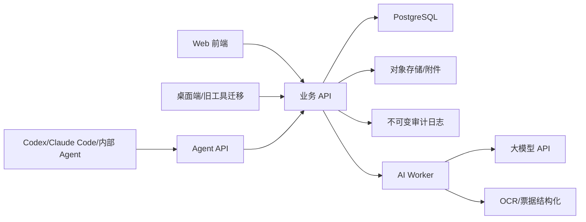

# 架构设计

## 1. 架构选择

第一阶段采用模块化单体 + 独立 AI worker。财务 ERP 的核心复杂度在领域规则、审计、事务一致性和期末状态控制，过早拆微服务会增加跨服务事务和追溯成本。



## 2. 技术建议

| 层 | 推荐 | 原因 |
| --- | --- | --- |
| 前端 | React/Next.js 或 Vite React | 表格、表单、账簿查询体验成熟 |
| 后端 | NestJS 或 Spring Boot | 强类型、模块边界清晰、适合企业系统 |
| 数据库 | PostgreSQL | 事务、索引、JSONB、审计与报表查询能力好 |
| 缓存/队列 | Redis | 异步任务、幂等锁、短期缓存 |
| 工作流 | Temporal/Camunda/轻量审批流 | 付款、记账、结账等需要状态机 |
| AI worker | Python 或 Node | OCR、LLM、向量检索和评估独立演进 |
| 报表 | 公式引擎 + 导出服务 | 支持法定报表和管理报表 |

## 3. 模块边界

- `platform`：账套、组织、权限、期间、审计。
- `master-data`：客户、供应商、人员、部门、存货、仓库、资产。
- `general-ledger`：科目、凭证、账簿、期末、辅助核算。
- `procure-to-pay`：采购、入库、应付、付款、核销。
- `order-to-cash`：销售、出库、应收、收款、核销。
- `inventory-costing`：库存、盘点、成本、收发存。
- `payroll`：工资项目、工资计算、分摊。
- `fixed-assets`：资产卡片、折旧、处置。
- `reporting`：报表模板、公式、编制、导出。
- `ai-assist`：OCR、AI 建议、Agent 动作、风险检查。

## 4. 核心数据原则

1. 正式财务数据不物理删除。
2. 已记账凭证只能通过冲销、调整或受控反向流程处理。
3. 单据状态机必须明确草稿、提交、审核、过账、关闭、取消。
4. 所有跨模块凭证都要保留来源单据 ID 和来源行 ID。
5. AI 建议独立存储，不混入正式凭证，直到人工审批通过。
6. Agent 操作必须带幂等键、dry-run 结果、权限主体、证据附件和审计日志。

## 5. 最小领域对象

```text
AccountSet
Organization
FiscalPeriod
Account
Voucher
VoucherLine
LedgerEntry
BusinessDocument
DocumentLine
Partner
InventoryItem
Warehouse
StockMovement
CostLayer
PayrollRun
FixedAsset
ReportTemplate
ReportRun
AiSuggestion
AgentAction
AuditLog
```

## 6. 迁移策略

旧项目 `C:\antigra-workplace\ai-finance-desktop` 可优先迁移：

- OCR 服务与票据识别调试能力。
- AI 供应商配置和模型解析能力。
- 凭证纸、凭证导出、财务报表导出。
- 审批流程和自动记账日志的已有测试思路。

迁移时先把能力抽象成 `ai-worker` 和 `general-ledger` 的接口，不直接复制 UI 结构。
