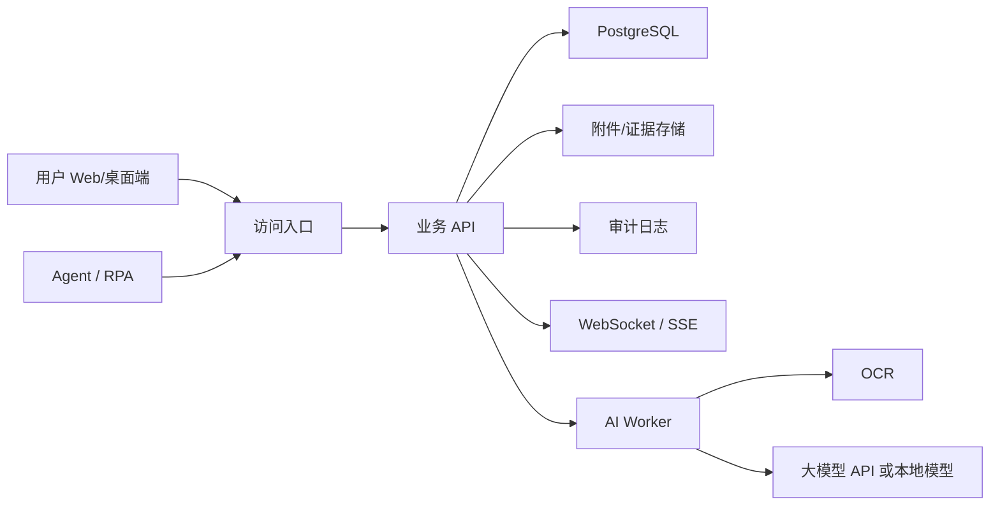

# 内网与公网兼容部署设计

## 1. 目标

AIS ERP Suite 要使用同一套系统同时支持内网部署和公网部署。产品不能做成单机账套文件，也不能只绑定某一种 SaaS 形态。无论部署在公司局域网、私有云、VPN 后面，还是公网 SaaS，核心业务规则、数据库结构、权限、审计和 Agent 工具接口都应保持一致。

一句话原则：

```text
同一套代码
同一套业务规则
同一套 API
不同部署拓扑
```

## 2. 为什么不用共享文件夹

多人财务软件不能把账套文件放在共享盘里让大家同时打开。

共享文件夹模式的问题：

- 多人同时编辑容易冲突。
- 文件损坏后恢复困难。
- 无法可靠控制谁能看、谁能改。
- 审计日志难做。
- 上传发票、合同、凭证附件不容易统一管理。
- Agent 无法稳定、安全地参与业务处理。
- 多地办公和远程访问很难扩展。

正确方式是中心服务器和中心数据库。

```text
用户浏览器 / 桌面端
-> 业务 API 服务
-> PostgreSQL 中心数据库
-> 文件/附件存储
-> 审计日志
-> 实时通知
```

## 3. 共同系统架构

无论内网还是公网，系统都使用同一套组件。



共同能力：

- 多用户登录。
- 多账套和组织隔离。
- 角色权限和数据范围权限。
- 中心数据库。
- 附件/证据统一保存。
- WebSocket 或 SSE 实时同步。
- 审批流。
- 审计日志。
- 备份恢复。
- Agent API 和 dry-run。

## 4. 部署模式

### 4.1 局域网内网部署

适合：

- 单办公室或单园区企业。
- 财务、仓库、业务人员都在公司网络内。
- 公司重视数据不出内网。
- 远程访问需求较少。

结构：

```text
公司内服务器
-> API 服务
-> PostgreSQL
-> 附件存储
-> 内网用户访问
```

访问方式：

```text
http://ais.local
https://erp.company.lan
```

优点：

- 数据留在公司。
- 局域网速度快。
- 成本可控。
- 传统企业更容易接受。

缺点：

- 远程办公需要 VPN。
- 服务器和备份要自己维护。
- 跨地区访问不方便。

### 4.2 私有云 / VPN 部署

适合：

- 多地办公。
- 老板、财务、仓库不在同一个地点。
- 企业希望远程访问，但不希望完全暴露到公网。
- 需要更稳定的备份和运维。

结构：

```text
云服务器或托管机房
-> 安全网关 / VPN / IP 白名单
-> API 服务
-> PostgreSQL
-> 附件存储
```

访问方式：

```text
通过 VPN 访问
通过企业安全网关访问
只允许白名单 IP 访问
```

优点：

- 支持多地使用。
- 比纯公网更安全。
- 比局域网更方便远程访问。
- 适合中小企业私有化部署。

缺点：

- 需要配置 VPN 或安全网关。
- 运维复杂度高于局域网。

### 4.3 公网 SaaS 部署

适合：

- 多客户 SaaS。
- 小微企业直接注册使用。
- 需要手机、外地、合作方随时访问。
- 软件服务商统一运维。

结构：

```text
公网 HTTPS
-> 负载均衡 / WAF
-> API 服务
-> 多租户数据库或租户隔离数据库
-> 对象存储
-> 监控和审计
```

访问方式：

```text
https://app.example.com
```

优点：

- 使用最方便。
- 易扩展。
- 易接入 Agent 和外部 API。
- 软件商统一维护版本。

缺点：

- 对安全和合规要求最高。
- 企业可能担心财务数据放公网。
- 必须做好租户隔离、加密、备份和访问控制。

## 5. 默认推荐

产品开发阶段推荐默认支持：

```text
开发环境：本机 Docker / 本机服务
小企业：局域网部署
中型企业：私有云 + VPN
未来商业化：公网 SaaS
```

开发时不要把逻辑写死到某一种部署模式里。所有部署只改变配置，不改变业务代码。

## 6. 多人实时同步

多人同时使用时，数据同步由服务器负责，不靠用户电脑之间互传。

典型流程：A 上传发票，B 立即看到。

```text
A 上传发票
-> API 保存附件
-> 数据库写入 evidence 记录
-> AI Worker 开始 OCR
-> OCR 结果写入数据库
-> 实时通道通知在线用户
-> B 的页面显示新发票和识别状态
```

实时同步建议：

- 在线提醒使用 WebSocket 或 SSE。
- 财务正式数据以数据库事务结果为准。
- 页面收到通知后重新查询最新数据。
- 不直接相信客户端本地状态。

## 7. 并发控制

多人同时编辑同一张单据或凭证时必须控制冲突。

推荐策略：

- 草稿单据使用乐观锁：保存时检查版本号。
- 审核、记账、结账使用状态机和数据库事务。
- 高风险动作使用幂等键，防止重复提交。
- 已记账数据不可直接编辑，只能冲销或调整。
- 页面显示“当前有人正在编辑”的协作提示。

关键字段：

```text
version
status
lockedByUserId
lockedAt
updatedAt
idempotencyKey
```

## 8. 数据隔离

系统必须从一开始支持多账套、多组织和未来多租户。

隔离层级：

```text
Tenant
-> AccountSet
-> Organization
-> Department
-> Role / User
```

局域网内网部署可以只有一个租户，但数据模型仍保留 `tenantId` 或等价隔离字段，未来迁移到 SaaS 时不需要重构。

## 9. 安全设计

内网不等于安全。无论部署在哪里，都必须具备：

- 用户登录和强密码策略。
- 角色权限。
- 数据范围权限。
- 审批流。
- 操作审计。
- 附件访问权限。
- 数据库备份。
- HTTPS 或内网 TLS。
- 重要操作二次确认。
- Agent 操作 dry-run 和审批。

公网 SaaS 额外要求：

- WAF。
- IP 限制或风控。
- 租户隔离。
- 敏感数据加密。
- 登录异常检测。
- 备份跨区域保存。

## 10. 配置方式

部署模式通过配置控制。

示例：

```text
DEPLOYMENT_MODE=lan | private_cloud | saas
PUBLIC_BASE_URL=https://app.example.com
DATABASE_URL=postgres://...
FILE_STORAGE_MODE=local | s3 | oss
REALTIME_MODE=websocket | sse
AI_MODEL_MODE=cloud | local
ALLOW_PUBLIC_SIGNUP=false
REQUIRE_VPN_HEADER=false
```

不同部署模式只改变配置和基础设施，不改变核心业务代码。

## 11. 对 Agent 的影响

Agent 在三种部署模式下都走同一套 Agent API。

内网部署：

- Agent 运行在内网机器或内网服务器。
- 可接入本地 OCR、本地模型或内网大模型网关。
- 不允许绕过内网权限直接读数据库。

私有云/VPN：

- Agent 通过 VPN 或安全网关访问。
- 适合多地协作和远程处理。

公网 SaaS：

- Agent 使用 OAuth、API Token 或企业授权访问。
- 必须按租户、账套和角色限制工具范围。

## 12. 验收标准

部署能力验收：

- 同一套代码可以在本地开发环境启动。
- 同一套代码可以在局域网服务器部署。
- 同一套代码可以通过公网 HTTPS 部署。
- 用户上传的附件能被其他授权用户看到。
- 多用户同时修改同一单据时不会互相覆盖。
- 已审核/已记账/已结账状态受服务器统一控制。
- 实时通知能提示新单据、新审批、新 OCR 结果。
- Agent API 在内网和公网部署下行为一致。
- 数据库和附件都能备份恢复。
