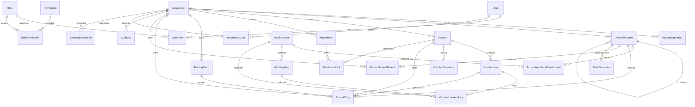

# Phase 1 Database ER Diagram

This diagram mirrors `packages/database/prisma/schema.prisma` and the Phase 1 general-ledger boundary.

Key Phase 1 invariants:

- Voucher posting writes `PostingBatch`, `JournalEntry`, `AccountPeriodBalance`, `VoucherStatusLog`, and `AuditLog` in one transaction in the real persistence layer.
- Posted vouchers cannot be edited, voided, or have attachments deleted.
- `sourceModule`, `sourceDocumentType`, `sourceDocumentId`, and related reserved fields allow later ERP modules to generate vouchers without changing the ledger core.
